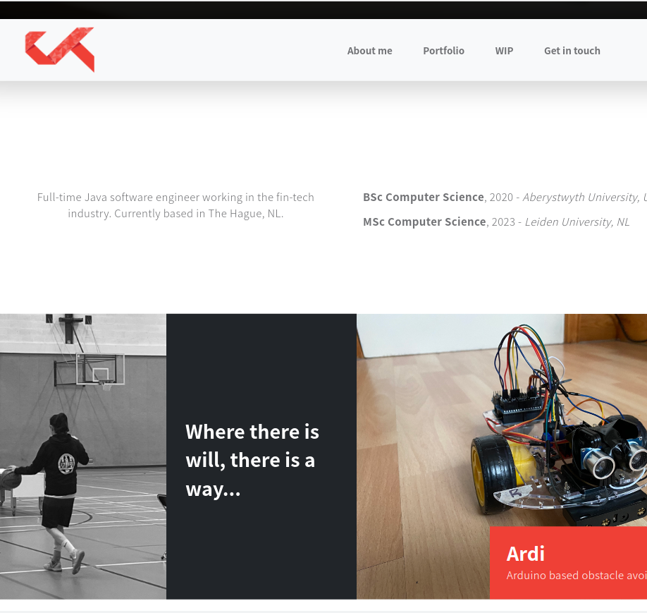

<!-- Improved compatibility of back to top link: See: https://github.com/othneildrew/Best-README-Template/pull/73 -->

<!--
*** Thanks for checking out the Best-README-Template. If you have a suggestion
*** that would make this better, please fork the repo and create a pull request
*** or simply open an issue with the tag "enhancement".
*** Don't forget to give the project a star!
*** Thanks again! Now go create something AMAZING! :D
-->

<!-- PROJECT SHIELDS -->
<!--
*** I'm using markdown "reference style" links for readability.
*** Reference links are enclosed in brackets [ ] instead of parentheses ( ).
*** See the bottom of this document for the declaration of the reference variables
*** for contributors-url, forks-url, etc. This is an optional, concise syntax you may use.
*** https://www.markdownguide.org/basic-syntax/#reference-style-links
-->

<!-- PROJECT LOGO -->
 

  

<h3 align="center">Personal Portfolio Website</h3>

<!-- ABOUT THE PROJECT -->
## Tech Stack

===
* Google domains - [www.trashlieva.dev](https://www.trashlieva.dev)
* GitHub Pages - [joanatrashlieva.github.io](https://github.com/JoanaTrashlieva/joanatrashlieva.github.io)
* [Nomad Force frontend template](https://themewagon.com/themes/nomad-force-free-bootstrap-5-html5-landing-page-template/)

(<a href="#readme-top">back to top</a>)

